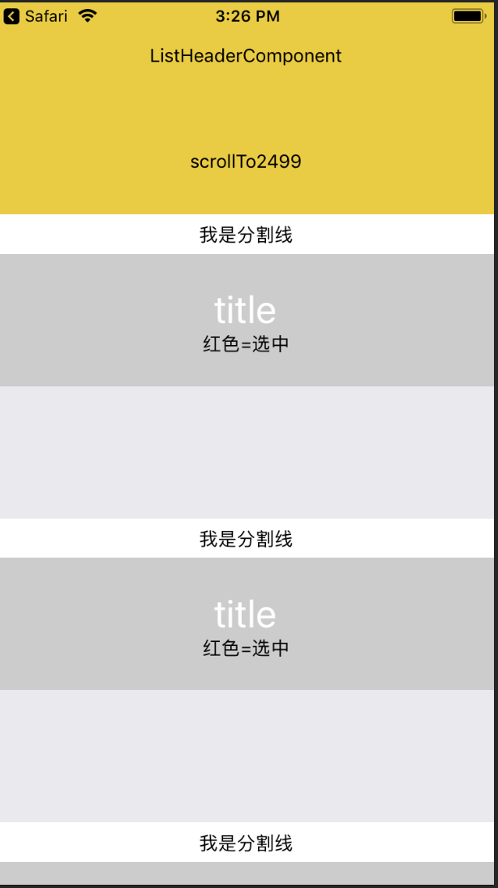
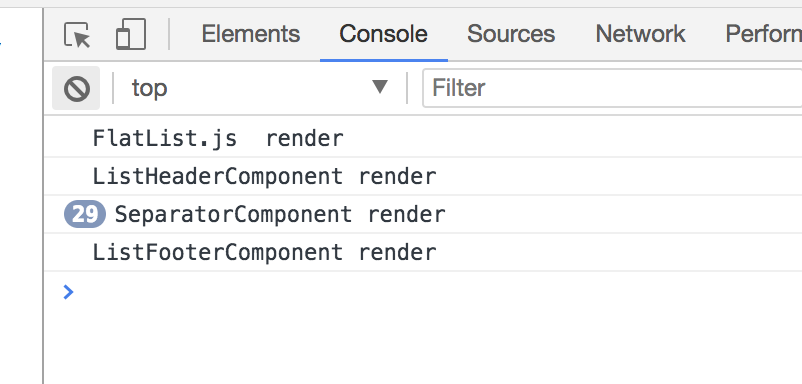
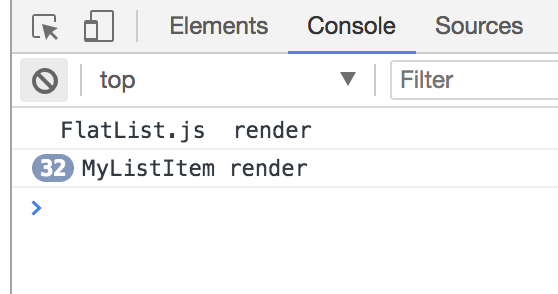

# react-native FlatList 
RN中使用长列表的时候经常会遇到性能的瓶颈，我们知道长列表组件的性能`scrollView`<`ListView`<`FlatList`，其中`ListView`, `FlatList`都是基于scrollView的封装，现在用的比较多的是FlatList，FlatList其实并没像原生一样做到复用，而是在js层做了一种边加载边删除的操作（在屏幕可见范围之外的一定区域直接用一个空白的View来占据位置），本文将通过解析源码来深入讲解使用FlatList过程中的注意点，从而达到性能最优

## demo 代码
先贴出我们测试的demo代码：
```javascript
/**
 * RN 0.45.0 flatList demo
 */
const React = require('react');
const ReactNative = require('react-native');
const {
    Image,
    Platform,
    TouchableHighlight,
    StyleSheet,
    Switch,
    Text,
    TextInput,
    View,
    FlatList,
    Dimensions,
    RefreshControl
} = ReactNative;
class MyListItem extends React.PureComponent {
    _onPress = () => {
        this.props.onPressItem(this.props.id);
    };

    render() {
        console.log('MyListItem render')
        const {id, title, selected} = this.props
        return (
            <TouchableHighlight
                {...this.props}
                onPress={this._onPress}

            >
                <View>
                    <View
                        style={[{height: 100, justifyContent: 'center', alignItems: 'center',},
                            selected ? {backgroundColor: '#f00'} : {backgroundColor: '#ccc'}
                        ]}>
                        <Text style={{fontSize: 30, color: '#fff'}}>{'title'}</Text>
                        <Text>红色=选中</Text>
                    </View>
                    <View style={{height: 100}} />
                </View>


            </TouchableHighlight>
        )
    }
}

function getMockData() {
    let result = [];
    for (let i = 0; i < 2500; i++) {
        result.push({
            id: i,
            title: `我是title${i}`,
            obj:[1,2,3]
        });
    }
    return result;
}
class DemoFlatList extends React.PureComponent {

    state = {
        selected: new Map(),
        isRefreshing: false
    };

    componentDidMount() {

    }

    static defaultProps = {
        data: getMockData()
    }

    _keyExtractor = (item, index) => item.id;

    _onPressItem = (id) => {
        // updater functions are preferred for transactional updates
        //console.log(this.state.selected.get(id))
        this.setState((state) => {
            // copy the map rather than modifying state.
            const selected = new Map(state.selected);
            selected.set(id, !selected.get(id)); // toggle
            return {selected};
        });
    };

    _renderItem = ({item,index}) => {
      //console.log(index)
      if(index===0){
        return (
          <TouchableHighlight onPress={() => this.flatList.scrollToIndex({index:2499})}>
            <View style={{height: 80, backgroundColor: '#ec0', justifyContent: 'center', alignItems: 'center'}}>
                <Text>scrollTo2499</Text>
            </View>
          </TouchableHighlight>
        )

      }else{
        return (
          <MyListItem
              id={item.id}
              onPressItem={this._onPressItem}
              selected={!!this.state.selected.get(item.id)}
              title={item.title}
          />
        );
      }
    }
    onRefresh = () => {
        this.setState({
            isRefreshing: true
        })
        setTimeout(()=>{
            this.setState({
                isRefreshing: false
            })
        },2000)
    }

    render() {
        return (
            <FlatList
                ItemSeparatorComponent={SeparatorComponent}
                ref = {(refs)=>{this.flatList=refs}}
                ListEmptyComponent={EmptyComponent}
                ListFooterComponent={ListFooterComponent}
                ListHeaderComponent={ListHeaderComponent}
                data={this.props.data}
                extraData={this.state}
                keyExtractor={this._keyExtractor}
                renderItem={this._renderItem}
                getItemLayout={(data, index) => ({length: 200, offset: 230 * index, index})}
                initialNumToRender={1}
                initialNumToRender={10}
                //refreshing={this.state.isRefreshing}
                //onRefresh={this.onRefresh}
                refreshControl={
                    <RefreshControl
                        refreshing={this.state.isRefreshing}
                        onRefresh={this.onRefresh}
                        tintColor="#fff"
                        title="Loading..."
                        titleColor="#fff"
                        colors={['#fff']}
                        progressBackgroundColor="#204c09"
                    />
                }
            />
        );
    }
}

class SeparatorComponent extends React.Component {
    render() {
        return (
            <View style={{height: 30, backgroundColor: '#ffffff', justifyContent: 'center', alignItems: 'center'}}>
                <Text>我是分割线</Text>
            </View>
        )
    }
}
class EmptyComponent extends React.Component {
    /**
     * 设置 defaultProps data:[]
     */
    render() {
        return (
            <View style={{height: 600, backgroundColor: '#ffffff', justifyContent: 'center', alignItems: 'center'}}>
                <Text>列表为空</Text>
            </View>
        )
    }
}
class ListFooterComponent extends React.Component {
    render() {
        return (
            <TouchableHighlight onPress={() => alert('I am ListFooterComponent')}>
                <View style={{height: 80, backgroundColor: '#ec0', justifyContent: 'center', alignItems: 'center'}}>
                    <Text>ListFooterComponent</Text>
                </View>
            </TouchableHighlight>
        )
    }
}
class ListHeaderComponent extends React.Component {
    render() {
        return (
            <TouchableHighlight onPress={() => alert('I am ListHeaderComponent')}>
                <View style={{height: 80, backgroundColor: '#ec0', justifyContent: 'center', alignItems: 'center'}}>
                    <Text>ListHeaderComponent</Text>
                </View>
            </TouchableHighlight>
        )
    }
}


module.exports = DemoFlatList;
```
在app中运行效果如下：



## FlatList 中的 PureComponent
`PureComponent`对应的在react中自定义组件`ReactCompositeComponent`里实现了`shouldComponentUpdate` 的浅比较（这里不过多解释react的源码，只要知道PureComponent里实现了浅比较即可），新手在使用FlatList可能会遇到改变state的值但是页面不触发render，很可能就是因为直接操作了state而不是重新返回一个state的对象，因为FlatList直接继承`PureComponent`。而我们在代码开发过程中必须要利用好这一浅比较机制,

修改代码如下：
```javascript
render() {
        return (
            <View style={{flex:1}}>
              <TouchableHighlight onPress={() => this.setState({a:1})}>
                <View style={{height: 80, backgroundColor: '#ec0', justifyContent: 'center', alignItems: 'center'}}>
                    <Text>click me</Text>
                </View>
              </TouchableHighlight>
              <FlatList
                ItemSeparatorComponent={SeparatorComponent}
                ref = {(refs)=>{this.flatList=refs}}
                ListEmptyComponent={EmptyComponent}
                ListFooterComponent={ListFooterComponent}
                ListHeaderComponent={ListHeaderComponent}
                data={this.props.data}
                extraData={this.state}
                keyExtractor={this._keyExtractor}
                renderItem={this._renderItem}
                getItemLayout={(data, index) => ({length: 200, offset: 230 * index, index})}
                initialNumToRender={1}
                initialNumToRender={10}
                //refreshing={this.state.isRefreshing}
                //onRefresh={this.onRefresh}
                refreshControl={
                    <RefreshControl
                        refreshing={this.state.isRefreshing}
                        onRefresh={this.onRefresh}
                        tintColor="#fff"
                        title="Loading..."
                        titleColor="#fff"
                        colors={['#fff']}
                        progressBackgroundColor="#204c09"
                    />
                }
            />
            </View>
        );
    }
}

```
这时在页面的顶端添加一个按钮，这个按钮做了一个无用的setState操作，我们看一下控制台的输出：



可见`SeparatorComponent`，`ListFooterComponent`，`ListHeaderComponent`触发了render操作，这些不必要的render操作必然会降低页面的渲染速度。解决办法，把上面这三个组件从原来继承自`React.Component` 改为 `React.PureComponent`。之后我们再测试果然不会触发render了。

### renderItem
FlatList中的`renderItem` 方法是用来渲染每一行的内容， 这是列表中最重要的部分，所以这里优化至关重要。

我们的demo中每一行的title都是可以点击的，通过点击改变`state.selected`，这个状态值是一个`Map`类型，如果里面的id对应的值为true则把这一栏的背景色渲染为红色，每次点击将对直接取反，而这个state是通过FlatList中的`extraData`传进去的。注意在点击之后setState操作，我们每次都是新建一个map而不是直接取修改map，可以试验一下，直接修改map页面将不会触发任何操作。

`renderItem`如果写成下面这样：
```javascript
_renderItem = ({item,index}) => {
  //console.log(index)
  if(index===0){
    return (
      <TouchableHighlight onPress={() => this.flatList.scrollToIndex{index:2499})}>
        <View style={{height: 80, backgroundColor: '#ec0', justifyContent:'center', alignItems: 'center'}}>
            <Text>scrollTo2499</Text>
        </View>
      </TouchableHighlight>
    )
  }else{
    return (
      <MyListItem
          id={item.id}
          onPressItem={(id) => {
            // updater functions are preferred for transactional updates
            //console.log(this.state.selected.get(id))
            this.setState((state) => {
                // copy the map rather than modifying state.
                const selected = new Map(state.selected);
                selected.set(id, !selected.get(id)); // toggle
                return {selected};
            });
          }}
          selected={!!this.state.selected.get(item.id)}
          title={item.title}
      />
    );
  }
}
```
点击一次之后的结果如下所示：



我们发现一次点击将会触发页面内其余的MyListItem的渲染，这是怎么回事呢？

注意我们修改的onPressItem，原来的代码是`onPressItem={this._onPressItem}`。***在render方法里jsx结构中，把方法作为回调，例如ref,或者点击事件等，不要直接写箭头函数或者直接进行bind操作绑定this，如果这样做，在每次render的时候都会重新创建该方法，会造成子组件内的PureComponent优化失效***

可以看一下FlatList源码的render部分，完全是遵守了这个规则：
```javascript
render() {
    if (this.props.legacyImplementation) {
      return <MetroListView {...this.props} items={this.props.data} ref={this._captureRef} />;
    } else {
      return (
        <VirtualizedList
          {...this.props}
          renderItem={this._renderItem}
          getItem={this._getItem}
          getItemCount={this._getItemCount}
          keyExtractor={this._keyExtractor}
          ref={this._captureRef}
          onViewableItemsChanged={this.props.onViewableItemsChanged && this._onViewableItemsChanged}
        />
      );
    }
  }

```

所以FlatList中在render每一项内容的时候，要利用好`PureComponent`的浅比较优化，一个长列表页是由其中的每一项构成的，只有在render里面的每一项内容的时候才是最消耗内存和时间。当然我们在写最外层FlatList结构的时候也去做好优化（不要直接写箭头函数的回调），但是其实在这里影响倒不是很大，这里在执行render操作的时候没有什么diff的耗时操作，本质只是一个自定义组件在内存中重新生成而已。