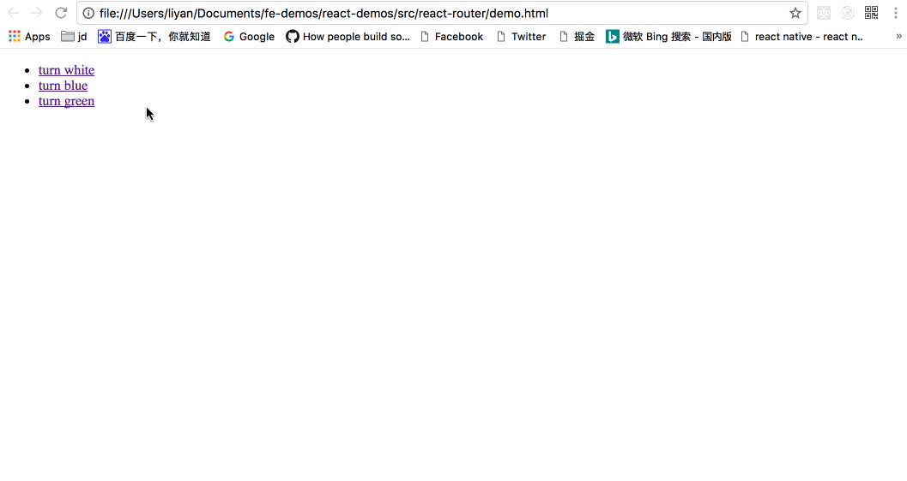
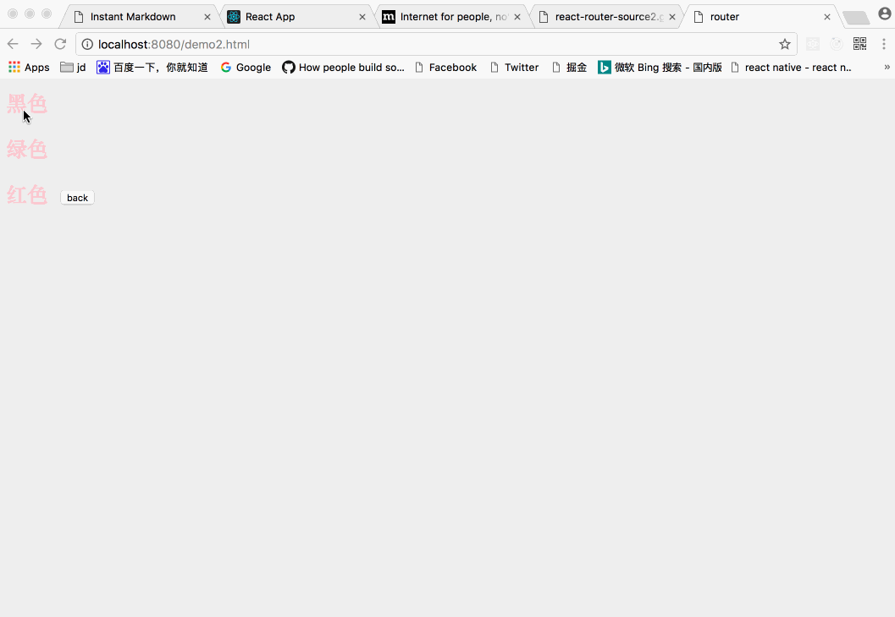

# react-router 源码分析

## hash 形式 简单路由实现
```javascript
<!DOCTYPE html>
<html lang="en">
<head>
    <meta charset="UTF-8">
    <title>router</title>
</head>
<body>
    <ul> 
        <li><a href="#/">turn white</a></li> 
        <li><a href="#/blue">turn blue</a></li> 
        <li><a href="#/green">turn green</a></li> 
    </ul> 
<script>
    function Router() {
        this.routes = {};
        this.currentUrl = '';
    }
    Router.prototype.route = function(path, callback) {
        this.routes[path] = callback || function(){};
    };
    Router.prototype.refresh = function() {
        this.currentUrl = location.hash.replace('#','') || '/';
        this.routes[this.currentUrl]();
    };
    Router.prototype.init = function() {
        window.addEventListener('load', this.refresh.bind(this), false);
        window.addEventListener('hashchange', this.refresh.bind(this), false);
    }
    window.Router = new Router();
    window.Router.init();
    var content = document.querySelector('body');
    // change Page anything
    function changeBgColor(color) {
        content.style.backgroundColor = color;
    }
    Router.route('/', function() {
        changeBgColor('white');
    });
    Router.route('/blue', function() {
        changeBgColor('blue');
    });
    Router.route('/green', function() {
        changeBgColor('green');
    });
</script>
</body>
</html>
```


这个路由demo以hash形式，当 url 的 hash 发生变化时，触发监听 hashchange 注册的回调，回调中去进行不同的操作，进行不同的内容的展示。

上面路由系统 Router 对象实现，主要提供三个方法：
* init 监听浏览器 url hash 更新事件
* route 存储路由更新时的回调到回调数组routes中，回调函数将负责对页面的更新
* refresh 执行当前url对应的回调函数，更新页面

以上为一个前端路由的简单实现，虽然简单，但实际上很多路由系统的根基都立于此，其他路由系统主要是对自身使用的框架机制的进行配套及优化，如与 react 配套的 react-router。

## HTML5 history API
> 通过history api 前进或后退页面

* `window.history.back()`  后退
* `window.history.forward()` 前进
* `window.history.go(-1)` 后退一个页面，如果 `window.history.go(1)`则前进一个页面，当前页面的索引为0。当然你也可以前进2个页面或后退2个页面，
* `window.history.length` 查看当前页面history栈的长度

> 增加或者修改history entries

HTML5提供了 `history.pushState()` 和 `history.replaceState() `方法用来修改键值对。还有一个`window.onpopstate`事件

* `history.pushState(stateObject, title, url)`  添加新的状态到历史状态栈
* `history.replaceState()`   用新的状态代替当前状态
* `window.onpopstate`  返回当前状态对象

通过history.pushState或者history.replaceState，也能做到：***改变 url 的同时，不会刷新页面***。所以 history 也具备实现路由控制的潜力。然而，还缺一点：hash 的改变会触发 onhashchange 事件，history 的改变会触发什么事件呢？ → 很遗憾，没有。

对于一个应用而言，url 的改变只能由以下 3 种途径引起：
1. 点击浏览器的前进或者后退按钮；
2. 点击 a 标签；
3. 在 JS 代码中直接修改路由

第 2 和第 3 种途径可以看成是一种，因为 a 标签的默认事件可以被禁止，进而调用 JS 方法。关键是第 1 种，HTML5 规范中新增了一个 onpopstate 事件，通过它便可以监听到前进或者后退按钮的点击。
**要特别注意的是：调用history.pushState和history.replaceState并不会触发 onpopstate 事件**。

## history 形式 简单路由实现
```javascript
<!DOCTYPE html>
<html lang="en">
<head>
    <meta charset="UTF-8">
    <title>router</title>
    <style>
        html,
        body {
            width: 100%;
            height: 100%;
            margin: 0;
        }
        div.router-wrap {
            width: 100%;
            height: 100%;
            background: #efefef;
        }
        a {
            display: inline-block;
            padding: 10px;
            color: pink;
            font-size: 25px;
            font-weight: bold;
            text-decoration: none;
        }
    </style>
</head>
<body>
    <div class="router-wrap">
        <a href="/black" class="history-link">黑色</a>
        <br>
        <a href="/green" class="history-link">绿色</a>
        <br>
        <a href="/red" class="history-link">红色</a>
        <button id="button">back</button>
    </div>

    <script>
        document.getElementById('button').onclick=function(){
            window.history.go(-1)
        }
        // 创建Router构造函数
        function Router() {
            this.currentRoute = '';
            this.routes = {};
            this.init();
        }

        // 注册路由函数
        Router.prototype.route = function (path, callback) {

            // 根据type类型，选择相应的history api。  
            this.routes[path] = function (type) {
                if (type == 'push') {
                    history.pushState({ path: path }, '', path);
                } else if (type == 'pop') {
                    history.replaceState({ path: path }, '', path);
                }
                callback();
            }
        }

        // 更新页面
        Router.prototype.refresh = function (path, type) {
            this.routes[path](type);
        }

        // 初始化
        Router.prototype.init = function () {

            var self = this;

            window.addEventListener('load', function () {
                //页面加载默认'/'路由，只是演示而已
                self.currentRoute = '/'
                console.log(self.currentRoute);
                self.refresh(self.currentRoute);
            });

            // 当用户点击前进后退按钮时触发函数
            window.addEventListener('popstate', function () {
                console.log('history.state.path:', history.state.path);
                self.currentRoute = history.state.path;
                self.refresh(self.currentRoute, 'pop');
            }, false);

            // 对所有的link标签进行绑定事件
            var historyLinks = document.querySelectorAll('.history-link');
            for (var i = 0, len = historyLinks.length; i < len; i++) {
                historyLinks[i].onclick = function (e) {
                    // 阻止默认
                    e.preventDefault();
                    self.currentRoute = e.target.getAttribute('href');
                    self.refresh(self.currentRoute, 'push');
                }
            }
        }
    </script>

    <script>
        var wrap = document.querySelector('.router-wrap');

        // 实例化Router
        window.Router = new Router();


        // 注册路由，实现相应功能

        Router.route('/', function () {
            wrap.style.backgroundColor = '#efefef'
        });

        Router.route('/black', function () {
            wrap.style.backgroundColor = 'black';
        });

        Router.route('/green', function () {
            wrap.style.backgroundColor = 'green';
        });

        Router.route('/red', function () {
            wrap.style.backgroundColor = 'red';
        });
    </script>
</body>
</html>
```


这个路由demo以history形式，当浏览器前进或者后退都会触发popstate的监听回调，页面中所有a标签的默认跳转都被`e.preventDefault();`禁止，转而执行`Router.prototype.refresh`，而其他点击按钮可以直接调用js方法

上面路由系统 Router 对象实现，主要提供三个方法：
* init 监听load,popstate，对所有的link标签进行绑定事件
* route 存储路由更新时的回调到回调数组routes中，回调函数将负责对页面的更新
* refresh 执行当前url对应的回调函数，更新页面

测试必须使用本地服务器上进行测试，如果使用file://的方式打开页面，会报错，`Uncaught SecurityError: A history state object with URL 'file:///C:/xxx/xxx/xxx/xxx.html' cannot be created in a document with origin 'null'.`  因为pushState的url和当前的Url必须是同源的，而file://的形式是不存在同源的说法的，所以我们必须用http://localhost的方式。

## 总结
基于上面hash和history的demo，可以选择hash或者history形式
* hash需要监听hashchange，所有的路由映射都保存在一个对象或者数组中，当hash变化会触发hashchange的回调，判断当前hash值对应哪个路由页面，并只把这个页面渲染出来，其余为Null
* history跟hash类似，只是监听的为popstate事件，而只有前进或者后退会触发popstate的监听，其他比如a标签的点击，或者button按钮的点击，需要自己封装逻辑：***通过history.pushState或者history.replaceState改变页面url（但是这个改变并不会触发页面刷新也不会触发popstate回调），再根据改变后的url进行页面刷新操作***

## 参考
[https://github.com/joeyguo/blog/issues/2](https://github.com/joeyguo/blog/issues/2)

[https://github.com/youngwind/blog/issues/109](https://github.com/youngwind/blog/issues/109)

[http://www.cnblogs.com/zhuzhenwei918/p/7421430.html](http://www.cnblogs.com/zhuzhenwei918/p/7421430.html)


 