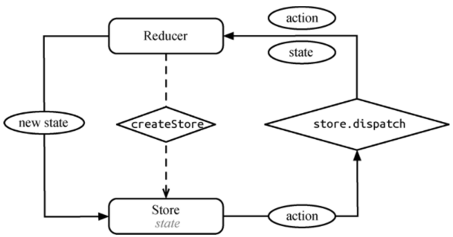
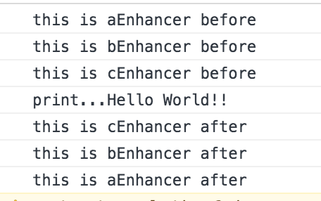
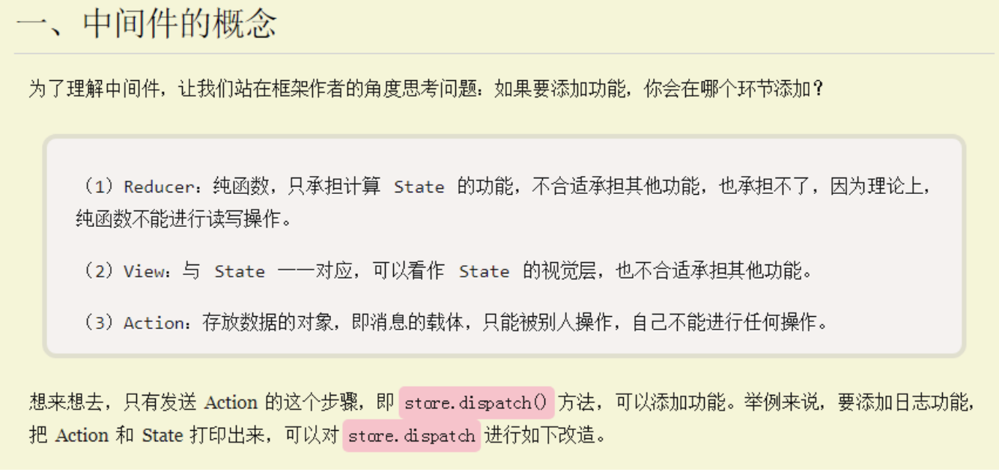

# redux 源码分析

## 核心概念
redux的核心思想来自于flux，可以说flux是规范，而state是实现。flux 的提出主要是针对现有前端 MVC 框架的局限总结出来的一套基于 dispatcher 的前端应用架构模式。如果用 MVC 的命名习惯，它应该叫 ADSV（Action Dispatcher Store View）。正如其名，Flux 的核心思想就是数据和逻辑永远单向流动。

redux 参考了 flux 的设计，但是对 flux 许多冗余的部分（如 dispatcher）做了简化，同时将函数式编程的思想融合其中。 



## createStore

精简后的代码：
```javascript
export const ActionTypes = {
    INIT: '@@redux/INIT'
}

export default function createStore(reducer, preloadedState, enhancer) {


    if (typeof enhancer !== 'undefined') {
        if (typeof enhancer !== 'function') {
            throw new Error('Expected the enhancer to be a function.')
        }

        return enhancer(createStore)(reducer, preloadedState)
    }

    //闭包私有变量
    let currentReducer = reducer;
    let currentState = preloadedState;
    let currentListeners = [];
    let nextListeners = currentListeners;
    let isDispatching = false;

    function ensureCanMutateNextListeners() {
        //如果 nextListeners和currentListeners指向同一个引用，就让他们不指向同一个对象
        if (nextListeners === currentListeners) {
            nextListeners = currentListeners.slice()
        }
    }

    //返回state
    function getState() {
        return currentState;
    }

    //监听
    function subscribe(listener) {
        if (typeof listener !== 'function') {
            throw new Error('Expected listener to be a function.')
        }
        let isSubscribed = true;
        ensureCanMutateNextListeners();
        nextListeners.push(listener);
        //卸载这个监听
        return function unsubscribe() {
            if (!isSubscribed) {
                return
            }
            isSubscribed = false
            ensureCanMutateNextListeners()
            const index = nextListeners.indexOf(listener)
            nextListeners.splice(index, 1)
        }
    }

    //触发一个action
    function dispatch(action) {
        //源码还检查了 isPlainObject  用了中间件后支持Promise, an Observable, a thunk, or something else 例如 redux-thunk 
        //检查action是否包含type
        if (typeof action.type === 'undefined') {
            throw new Error(
                'Actions may not have an undefined "type" property. ' +
                'Have you misspelled a constant?'
            )
        }

        if (isDispatching) {
            throw new Error('Reducers may not dispatch actions.')
        }

        try {
            isDispatching = true
            currentState = currentReducer(currentState, action)
        } finally {
            isDispatching = false
        }
        const listeners = currentListeners = nextListeners
        listeners.forEach(listener => listener());
        //为了方便，返回action
        return action
    }
    //动态加载一些reducers 或者需要reducer的热加载
    function replaceReducer(nextReducer) {
        if (typeof nextReducer !== 'function') {
            throw new Error('Expected the nextReducer to be a function.')
        }

        currentReducer = nextReducer
        dispatch({ type: ActionTypes.INIT })

    }

    //当store被创建的时候，就会dispatch 一个init的action用于初始化state
    //因为reducer要求没有匹配的action就返回default，switch case最后有个default
    dispatch({ type: ActionTypes.INIT })
    return {
        dispatch,
        subscribe,
        getState,
        replaceReducer,
    }
}
```
createStore函数用来创建store，而store是redux的核心，几乎redux所有概念都跟store有关。createStore是一个闭包函数，私有变量currentListeners数组用来保存所有监听函数，闭包返回一个具有四个函数dispatch，subscribe，getState，replaceReducer的对象。
* dispatch，该方法接收一个action，代码首先调用createStore传入reducer方法，传入的参数分别为currentState（这个state是下面getState方法返回的）和action，然后再遍历私有属性currentListeners执行里面保存的监听函数，最后返回传入的action
* subscribe，改方法接收一个监听函数，监听函数会被push进私有变量currentListeners数组里，最后的返回值是一个叫unsubscribe的解绑函数，调用该解绑函数，会将已经添加的监听函数删除，该监听函数处于一个闭包之中，会一直存在，所以在解绑函数中能删除该监听函数。
* getState，返回闭包私有变量currentState
* replaceReducer，替换当前的reducer的函数，replaceReducer接受一个新的reducer，替换完成之后，会执行 dispatch({ type: ActionTypes.INIT }) ，用来初始化store的状态

## combineReducers
```javascript

export default function combineReducers(reducers){
    //源码里检查了对象的key-value，value不是undefined并且为function
    //assertReducerShape 对reducer的初始state进行检查
    return function combination(state={},action){
        const finalReducerKeys = Object.keys(reducers)
        let hasChanged = false
        const nextState = {}
        finalReducerKeys.forEach(key=>{
            const reducer = reducers[key]
            const previousStateForKey = state[key]
            const nextStateForKey = reducer(previousStateForKey, action)
            nextState[key] = nextStateForKey
            /**
             * nextStateForKey !== previousStateForKey 浅比较
             * 如果reducer直接改变对象的属性而不是返回一个新对象，那么hasChanged将为false，
             * 导致执行完reducer将返回旧的state，页面可能不会刷新
             * 这就是为什么Redux需要reducers是纯函数的原因:
             * 
             * 比较两个Javascript对象所有的属性是否相同的的唯一方法是对它们进行深比较。
             * 但是深比较在真实的应用当中代价昂贵，因为通常js的对象都很大，同时需要比较的次数很多。
             * 因此一个有效的解决方法是作出一个规定：无论何时发生变化时，开发者都要创建一个新的对象，然后将新对象传递出去。
             * 同时，当没有任何变化发生时，开发者发送回旧的对象。也就是说，新的对象代表新的state。
             * 
             */
            hasChanged = hasChanged || nextStateForKey !== previousStateForKey
        })
        return hasChanged ? nextState : state
    }
}
```
combineReducers() 所做的只是生成一个函数，这个函数来调用你的一系列 reducer，
每个 reducer 根据它们的 key 来筛选出 state 中的一部分数据并处理，
然后这个生成的函数再将所有 reducer 的结果合并成一个大的对象。没有任何魔法。
正如其他 reducers，如果 combineReducers() 中包含的所有 reducers 都没有更改 state，
那么也就不会创建一个新的对象。

举个例子：
```javascript
var reducers = {
    todos: (state, action) { // 此处的 state 参数是全局 state.todos属性
        switch (action.type) {...} // 返回的 new state 更新到全局 state.todos 属性中
    },
    activeFilter: (state, action) { // 拿到 state.activeFilter 作为此处的 state
        switch (action.type) {...} // new state 更新到全局 state.activeFilter 属性中
    }
}
var rootReducer = combineReducers(reducers)
```
combineReducers内部会将state.todos属性作为todos: (state, action)的state参数传进去，通过switch (action.type)之后返回的new state也会更新到state.todos 属性中；也会将state.activeFilter属性作为activeFilter: (state, action)的state参数传进去，通过switch (action.type)之后返回的new state也会更新到state.activeFilter属性中。

注意源码中 `hasChanged = hasChanged || nextStateForKey !== previousStateForKey` ，nextStateForKey !== previousStateForKey 为浅比较，如果reducer直接改变对象的属性而不是返回一个新对象，那么hasChanged将为false，导致执行完reducer将返回旧的state，页面可能不会刷新。redux源码巧妙的使用了对象的浅比较。**比较两个Javascript对象所有的属性是否相同的的唯一方法是对它们进行深比较。但是深比较在真实的应用当中代价昂贵，因为通常js的对象都很大，同时需要比较的次数很多。因此一个有效的解决方法是作出一个规定：无论何时发生变化时，开发者都要创建一个新的对象，然后将新对象传递出去。同时，当没有任何变化发生时，开发者发送回旧的对象。也就是说，新的对象代表新的state**，这就解释了为什么reducer需要是一个纯函数了，reducer规定如果state的状态发生了变化，那就需要返回一个新的对象，否则就返回原来的state对象。

## compose
```javascript
export default function compose(...funcs) {
    if (funcs.length === 0) {
        return arg => arg
    }

    if (funcs.length === 1) {
        return funcs[0]
    }

    return funcs.reduce((a, b) => (...args) => a(b(...args)))
}
```
compose巧妙的使用了数组的reduce方法，做的只是让你在写深度嵌套的函数时，避免了代码的向右偏移

下面举个例子：
```javascript
/**
 * enhancer 方法接受一个方法originF， 返回一个增强的方法EF。 
 * 对EF我们可以再次 增强，所以这里是可以链式调用的
 * @param {*} originF 
 */
var aEnhancer = function (originF) {
    return function EF(...args) {
        console.log('this is aEnhancer before')
        var r = originF(...args)
        console.log('this is aEnhancer after')
        return r
    }
}

var bEnhancer = function (originF) {
    return function (...args) {
        console.log('this is bEnhancer before')
        var r = originF(...args)
        console.log('this is bEnhancer after')
        return r
    }
}

var cEnhancer = function (originF) {
    return function (...args) {
        console.log('this is cEnhancer before')
        var r = originF(...args)
        console.log('this is cEnhancer after')
        return r
    }
}

function print(a) {
    console.log(`print...${a}`)
}
```
**写法一：**

```javascript
aEnhancer(bEnhancer(cEnhancer(print)))('Hello World!!')
```



**写法二：**

```javascript
var enhancerArray = [cEnhancer, bEnhancer, aEnhancer]
function enhancerFun(originF) {
    let of = originF
    enhancerArray.forEach(enhancer => {
        of = enhancer(of)
    })
    return of
}
enhancerFun(print)('Hello World!!')
```


**写法三：** 巧妙的使用了数组的reduce方法，也是compose的实现方法

```javascript
var enhancerArray2 = [aEnhancer, bEnhancer, cEnhancer]
function enhancerFun2(originF) {
    return enhancerArray2.reduce((a, b) => (...args) => a(b(...args)(originF)
}
enhancerFun2(print)('Hello World!!')
```


## bindActionCreators
```javascript
function bindActionCreator(actionCreator, dispatch) {
    return (...args) => dispatch(actionCreator(...args))

}
/**
 * 使用 dispatch 把每个 action creator 包围起来，这样可以直接调用它们
 * 可以import * as 传入一组functions 或者传入一个function
 * @param {*} actionCreator 
 * @param {*} dispatch 
 */
export default function bindActionCreators(actionCreators, dispatch) {
    if (typeof actionCreators === 'function') {
        return bindActionCreator(actionCreators, dispatch)
    }
    const boundActionCreators = { }
    Object.keys(actionCreators).forEach(key => {
        boundActionCreators[key] = bindActionCreator(actionCreators[key], dispatch)
    })
    return boundActionCreators
}
```
bindActionCreators的代码比较简单，就是将actionCreator和dispatch联结在一起。对于多个 actionCreator，我们可以像reducers一样，组织成一个key/action的组合。***原本的 reducer(state, action) 模式，我们用 createStore(reducer, initialState) 转换成 store.dispatch(action)，现在发现还不够，怎么做？再封装一层呗，这就是函数式思想的体现，通过反复组合，将多参数模式，转化为单参数模式***。

## applyMiddleware
```javascript
export default function applyMiddleware(...middlewares) {
    //返回的函数在createStore中被调用
    return (createStore) => (reducer, preloadedState, enhancer) => {
        const store = createStore(reducer, preloadedState, enhancer)
        let dispatch = store.dispatch //拿到真正的 dispatch
        let chain = []
        // 将最重要的两个方法 getState/dispatch 整合出来,这2个就是中间件需要传的参数
        const middlewareAPI = {
            getState: store.getState,
            dispatch: (action) => dispatch(action)
        }
        // 依次传递给 middleware，让它们有控制权,这里的middlewareAPI就是中间件的第一个参数
        chain = middlewares.map(middleware => middleware(middlewareAPI))
        dispatch = compose(...chain)(store.dispatch) // 再组合出新的 dispatch
        //这里的store.dispatch是中间件返回值接收的参数，即redux-thunk源码里的next

        // 返回新的store dispatch被新的dispatch替代
        return {
            ...store,
            dispatch
        }
    }
}
```
顾名思义，applyMiddleware就是中间件的意思。applyMiddleware接收中间件为参数，并返回一个以createStore为参数的函数；同时applyMiddleware又是createStore函数中的第三个参数，所以我们回到createStore的代码，找到了：
```javascript
export default function createStore(reducer, preloadedState, enhancer) {


    if (typeof enhancer !== 'undefined') {
        if (typeof enhancer !== 'function') {
            throw new Error('Expected the enhancer to be a function.')
        }

        return enhancer(createStore)(reducer, preloadedState)
    }
}
```
当createStore中传了第三个参数的时候，会执行enhancer(createStore)(reducer, preloadedState,enhancer)，这是一个柯里化函数。下面看一个经典的中间件redux-thunk的源码：
```javascript
function createThunkMiddleware(extraArgument) {
  return ({ dispatch, getState }) => next => action => {
    if (typeof action === 'function') {
      return action(dispatch, getState, extraArgument);
    }

    return next(action);
  };
}

const thunk = createThunkMiddleware();
thunk.withExtraArgument = createThunkMiddleware;

export default thunk;
```
redux-thunk返回一个函数，函数的第一个参数是一个object对象{ dispatch, getState }，这个参数在applyMiddleware源码里`chain = middlewares.map(middleware => middleware(middlewareAPI))` 以`middlewareAPI`名称传入，第二个参数`next`在applyMiddleware源码里`dispatch = compose(...chain)(store.dispatch)`以`store.dispatch`名称传入。

***注意，在每个中间件里存在两个 dispatch 功能。一个是 { dispatch, getState }，这是在 middlewareAPI对象里的 dispatch 方法，另一个是 next，它是 chain 链条的最后一环 dispatch = compose(...chain, dispatch)。如果你不想在将 action 传递到在你之后的中间件里，你应该直接显式地调用 dispatch，不要调用 next。如果你发现这个 action 对象不包含你感兴趣的数据，是你要忽略的 action，这时应该传给 next，它可能是其他中间件的处理目标。***

由此可见，每个中间件的格式都应该是接收一个`{ dispatch, getState }`，返回一个`(dispatch) => { return function(action) { ... } }`。

为什么中间件要放在dispatch的时候？借用阮老师的一张图：




## 参考
[https://github.com/antgod/blog/blob/master/文章/react源码解析系列/6.redux源码解析.md](https://github.com/antgod/blog/blob/master/文章/react源码解析系列/6.redux源码解析.md)

[https://segmentfault.com/a/1190000003791415](https://segmentfault.com/a/1190000003791415)

[http://div.io/topic/1309](http://div.io/topic/1309)

[https://github.com/dushao103500/blog/issues/1](https://github.com/dushao103500/blog/issues/1)


 